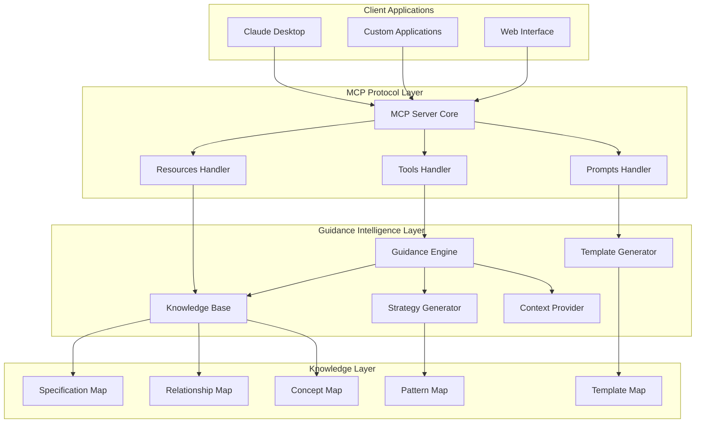
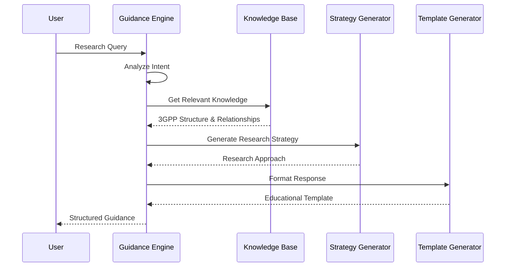
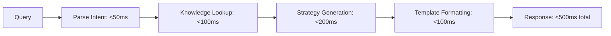

# Architecture Guide - V2 Lightweight Guidance Approach

## System Overview

The v2 3GPP MCP Server is designed as a **knowledge-driven guidance system** that provides intelligent research assistance rather than data storage and retrieval. The architecture prioritizes expertise transfer, educational value, and efficient guidance generation.

## Architecture Principles

### 1. **Knowledge Over Data**
- Store structured knowledge about 3GPP, not specification content
- Maintain relationships and patterns, not text documents
- Focus on intelligence and understanding, not information retrieval

### 2. **Guidance Over Answers**
- Provide research strategies rather than final answers
- Teach methodology rather than deliver results
- Enable user learning rather than replace user thinking

### 3. **Lightweight Over Comprehensive**
- Optimize for speed and efficiency
- Minimize resource requirements
- Prioritize essential guidance capabilities

### 4. **Adaptive Over Static**
- Adjust guidance based on user context and expertise level
- Learn from interaction patterns
- Evolve knowledge base based on user needs

## High-Level Architecture



## Component Architecture

### MCP Server Core

**File**: `src/index.ts`
**Role**: Lightweight MCP protocol implementation focused on guidance

```typescript
class GPPGuidanceMCPServer {
  private server: MCP.Server
  private guidanceEngine: GuidanceEngine
  private knowledgeBase: KnowledgeBase
  private templateGenerator: TemplateGenerator
}
```

**Key Differences from V1**:
- No large dataset management
- No complex search infrastructure
- Focus on rapid guidance generation
- Educational response formatting

### Guidance Engine

**File**: `src/utils/guidance-engine.ts`
**Role**: Core intelligence for providing 3GPP research guidance

```typescript
interface GuidanceEngine {
  analyzeQuery(query: string): Promise<QueryAnalysis>
  generateGuidance(analysis: QueryAnalysis): Promise<GuidanceResponse>
  adaptToUserLevel(guidance: GuidanceResponse, level: ExpertiseLevel): Promise<GuidanceResponse>
}
```

**Architecture**:


### Knowledge Base

**File**: `src/utils/knowledge-base.ts`
**Role**: Structured 3GPP domain knowledge without specification text

```typescript
interface KnowledgeBase {
  specifications: SpecificationMap
  relationships: RelationshipMap
  concepts: ConceptMap
  protocols: ProtocolMap
  procedures: ProcedureMap
  searchPatterns: SearchPatternMap
}
```

**Knowledge Structure**:
```typescript
interface SpecificationMetadata {
  id: string                    // "TS 24.501"
  title: string                 // "5G NAS Protocol"
  series: string                // "24"
  release: string               // "Rel-16"
  purpose: string               // What this spec defines
  keyTopics: string[]           // Main topics covered
  relationships: string[]       // Related specifications
  searchKeywords: string[]      // Effective search terms
  typicalQuestions: string[]    // Common research questions
  implementationGuidance: string[] // Implementation considerations
}
```

### Strategy Generator

**File**: `src/utils/strategy-generator.ts`
**Role**: Creates targeted research strategies based on user queries

```typescript
interface StrategyGenerator {
  createSearchStrategy(topic: string): Promise<SearchStrategy>
  generateReadingSequence(specs: string[]): Promise<ReadingSequence>
  suggestKeywords(domain: string): Promise<KeywordSuggestion[]>
  mapRequirementsToSpecs(requirements: string[]): Promise<SpecificationMapping>
}
```

**Strategy Types**:
- **Exploratory**: For broad topics and learning
- **Targeted**: For specific implementation questions
- **Comparative**: For analyzing differences between approaches
- **Troubleshooting**: For debugging and problem-solving

### Template Generator

**File**: `src/utils/template-generator.ts`
**Role**: Formats guidance into educational, actionable responses

```typescript
interface TemplateGenerator {
  formatSpecificationGuidance(spec: SpecificationMetadata): Promise<string>
  createResearchPlan(strategy: SearchStrategy): Promise<string>
  generateComparisonGuide(specs: string[]): Promise<string>
  buildImplementationRoadmap(requirements: string[]): Promise<string>
}
```

**Template Categories**:
- **Discovery Templates**: Help users find relevant specifications
- **Learning Templates**: Structured educational content
- **Analysis Templates**: Comparative and analytical guidance
- **Implementation Templates**: Practical implementation guidance

## Data Architecture

### Knowledge Representation

Instead of storing specification text, v2 maintains structured knowledge:

```typescript
interface StructuredKnowledge {
  // Specification organization
  series: {
    "21": { name: "Requirements", description: "Service requirements", workingGroup: "SA1" }
    "24": { name: "Protocols", description: "Core network protocols", workingGroup: "CT1" }
    "36": { name: "LTE Radio", description: "LTE radio access", workingGroup: "RAN2" }
    "38": { name: "5G Radio", description: "5G NR radio access", workingGroup: "RAN2" }
  }

  // Protocol relationships
  protocolStack: {
    "NAS": { layer: "L3", protocols: ["Registration", "Session"], specs: ["24.301", "24.501"] }
    "RRC": { layer: "L3", protocols: ["Connection", "Mobility"], specs: ["36.331", "38.331"] }
    "PDCP": { layer: "L2", protocols: ["Compression", "Security"], specs: ["36.323", "38.323"] }
  }

  // Common research patterns
  patterns: {
    "authentication": {
      startingSpecs: ["33.501", "24.501"],
      keywords: ["SUCI", "5G-AKA", "authentication"],
      readingOrder: ["architecture", "procedures", "implementation"]
    }
  }
}
```

### Memory Optimization

**Efficient Storage**:
- **Compact Representations**: Use IDs and references instead of full text
- **Lazy Loading**: Load knowledge sections on demand
- **Caching Strategy**: Cache frequently used patterns and templates
- **Memory Limits**: Target <100MB total memory usage

**Example Efficient Structure**:
```typescript
class CompactKnowledge {
  private specMap: Map<string, number> = new Map()  // ID to index mapping
  private specData: SpecificationMetadata[] = []    // Compact array storage
  private relationships: number[][] = []            // Index-based relationships

  getSpecification(id: string): SpecificationMetadata | null {
    const index = this.specMap.get(id)
    return index !== undefined ? this.specData[index] : null
  }
}
```

## Performance Architecture

### Response Generation Pipeline

**Sub-second Response Targets**:


**Optimization Strategies**:
- **Pre-computed Templates**: Common guidance patterns cached
- **Intent Classification**: Fast query categorization
- **Knowledge Indexing**: Efficient lookup structures
- **Response Caching**: Cache similar guidance responses

### Concurrent Handling

**Stateless Design**:
```typescript
class StatelessGuidanceEngine {
  // No instance state - all context passed in requests
  async generateGuidance(query: UserQuery, context: RequestContext): Promise<GuidanceResponse> {
    // Thread-safe, stateless processing
  }
}
```

**Scalability Features**:
- **No Shared State**: Each request is independent
- **Minimal Memory**: <5MB per concurrent request
- **Fast Startup**: <2 seconds initialization
- **High Throughput**: 1000+ requests/second capacity

## Tool Architecture

### Core Guidance Tools

#### `guide_specification_search`

**Purpose**: Help users formulate effective specification searches

```typescript
interface SpecificationSearchGuidance {
  suggestedSpecs: SpecificationSuggestion[]
  searchStrategy: SearchStrategy
  keywords: string[]
  tips: string[]
}
```

**Implementation**:
```typescript
async handleGuideSearch(args: SearchGuidanceArgs): Promise<MCPResponse> {
  const analysis = await this.analyzeSearchIntent(args.query)
  const suggestions = await this.knowledgeBase.getSuggestedSpecs(analysis)
  const strategy = await this.strategyGenerator.createSearchStrategy(analysis)

  return this.templateGenerator.formatSearchGuidance({
    suggestions,
    strategy,
    explanation: this.explainReasoning(analysis),
    nextSteps: this.suggestNextSteps(strategy)
  })
}
```

#### `explain_3gpp_structure`

**Purpose**: Provide educational content about 3GPP organization

```typescript
interface GPPStructureExplanation {
  seriesOverview: SeriesDescription[]
  workingGroups: WorkingGroupInfo[]
  releaseTimeline: ReleaseInfo[]
  relationships: SpecificationRelationship[]
}
```

#### `map_requirements_to_specs`

**Purpose**: Help users map technical requirements to appropriate specifications

```typescript
interface RequirementMapping {
  primarySpecs: string[]          // Main specifications to check
  supportingSpecs: string[]       // Additional relevant specs
  readingOrder: string[]          // Suggested sequence
  keyTopics: string[]            // Important topics to focus on
  implementation: string[]        // Implementation considerations
}
```

#### `generate_research_strategy`

**Purpose**: Create comprehensive research approaches for complex topics

```typescript
interface ResearchStrategy {
  approach: string               // Overall strategy description
  phases: ResearchPhase[]        // Step-by-step research phases
  resources: string[]            // Recommended tools and resources
  timeline: string              // Estimated time requirements
  deliverables: string[]        // Expected outputs
}
```

### Resource Architecture

#### `3gpp://knowledge/series`

**Description**: Comprehensive guide to 3GPP specification series

```typescript
interface SeriesKnowledge {
  series: {
    [key: string]: {
      name: string
      description: string
      workingGroup: string
      typicalContent: string[]
      whenToUse: string[]
      keySpecs: string[]
    }
  }
}
```

#### `3gpp://knowledge/protocols`

**Description**: Protocol relationship mapping and guidance

```typescript
interface ProtocolKnowledge {
  protocols: {
    [key: string]: {
      fullName: string
      layer: string
      purpose: string
      relatedProtocols: string[]
      implementationSpecs: string[]
      commonQuestions: string[]
    }
  }
}
```

#### `3gpp://knowledge/research-patterns`

**Description**: Common research patterns and methodologies

```typescript
interface ResearchPatterns {
  patterns: {
    [key: string]: {
      description: string
      applicableScenarios: string[]
      steps: ResearchStep[]
      expectedOutcomes: string[]
      commonPitfalls: string[]
    }
  }
}
```

## Integration Architecture

### MCP Protocol Compliance

**Lightweight MCP Implementation**:
```typescript
class LightweightMCPServer {
  private tools: Map<string, GuidanceTool> = new Map()
  private resources: Map<string, KnowledgeResource> = new Map()
  private prompts: Map<string, EducationalPrompt> = new Map()

  // Minimal overhead MCP handlers
  async handleToolCall(request: ToolCallRequest): Promise<ToolResponse> {
    const tool = this.tools.get(request.name)
    return tool ? await tool.execute(request.arguments) : this.errorResponse(request.name)
  }
}
```

### Client Integration Patterns

**Claude Desktop Configuration**:
```json
{
  "mcpServers": {
    "3gpp-guidance": {
      "command": "node",
      "args": ["dist/index.js"],
      "cwd": "/path/to/3gpp-mcp-server-v2",
      "description": "Lightweight 3GPP research guidance"
    }
  }
}
```

**Custom Application Integration**:
```typescript
// Minimal integration overhead
const guidanceClient = new MCPClient("3gpp-guidance")
await guidanceClient.connect()

const guidance = await guidanceClient.callTool('guide_specification_search', {
  query: 'NAS authentication procedures',
  userLevel: 'intermediate'
})
```

## Security & Privacy Architecture

### Minimal Attack Surface

**Security Benefits of Lightweight Design**:
- **No Large Datasets**: No sensitive specification content stored
- **Read-Only Knowledge**: Knowledge base is static and read-only
- **Stateless Processing**: No user data persistence
- **Simple Deployment**: Fewer components to secure

**Security Measures**:
```typescript
interface SecurityControls {
  inputValidation: {
    maxQueryLength: 1000
    sanitizeInput: boolean
    rateLimiting: boolean
  }

  outputSecurity: {
    preventCodeInjection: boolean
    sanitizeResponses: boolean
    limitResponseSize: boolean
  }
}
```

### Privacy Design

**Privacy-First Approach**:
- **No Query Logging**: Queries are not stored or logged
- **No User Tracking**: No persistent user identification
- **No External Calls**: All processing happens locally
- **No Data Collection**: No usage analytics or data gathering

## Monitoring Architecture

### Lightweight Monitoring

**Essential Metrics**:
```typescript
interface LightweightMetrics {
  performance: {
    responseTime: Histogram       // <500ms target
    throughput: Counter          // Requests per second
    errorRate: Counter           // Error percentage
  }

  usage: {
    toolUsage: Counter           // Which tools are popular
    queryPatterns: Counter       // Common query types
    userSatisfaction: Gauge      // Response quality feedback
  }

  system: {
    memoryUsage: Gauge          // <100MB target
    cpuUsage: Gauge             // CPU efficiency
    uptime: Counter             // System availability
  }
}
```

**Health Monitoring**:
```typescript
interface HealthChecks {
  knowledgeBase: () => Promise<boolean>    // Knowledge base accessibility
  responseGeneration: () => Promise<boolean> // Can generate responses
  memoryUsage: () => Promise<boolean>      // Memory within limits
  responseTime: () => Promise<boolean>     // Response time acceptable
}
```

This architecture provides a sustainable, educational, and efficient foundation for 3GPP research guidance while maintaining the simplicity and performance benefits of the MCP protocol design philosophy.