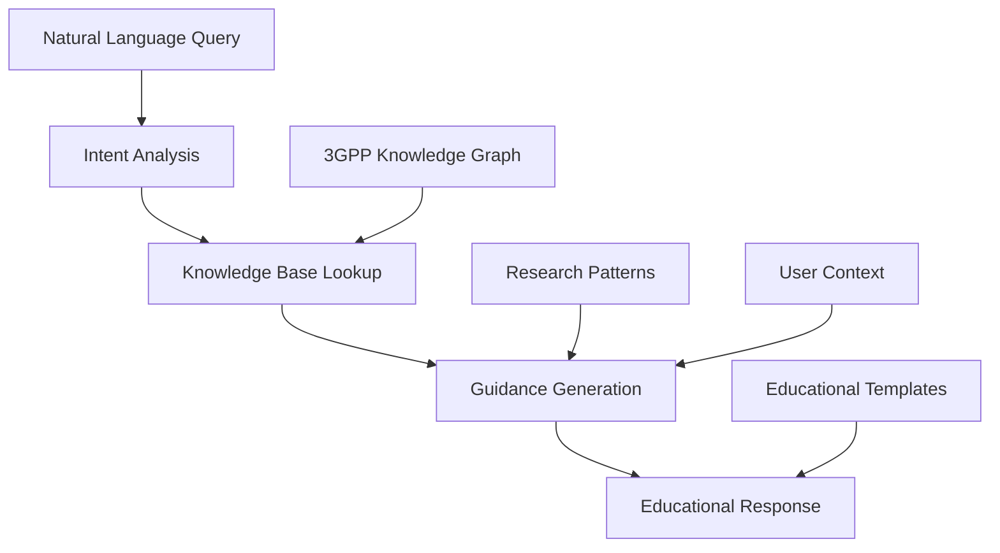

# Project Concept & Vision - V2 Guidance Approach

## Vision Statement

**Transform 3GPP specification research from data hosting to intelligent guidance.**

Our vision is to create an AI-powered interface that teaches users how to effectively research 3GPP telecommunications specifications rather than attempting to cache and provide specification content locally.

## Core Concept - The Paradigm Shift

### The Problem We're Solving

Imagine you're a telecom engineer working on 5G implementation. You need to understand how NAS authentication works. Today, you would:

1. Navigate to 3GPP website
2. Search for "NAS authentication"
3. Find TS 24.301 (if you know to look there)
4. Download a 500+ page PDF
5. Search through dense technical text
6. Cross-reference with other specifications
7. Interpret complex procedures manually

**With our V2 MCP Server:**
- Ask: *"How does NAS authentication work in 5G?"*
- Get: **Intelligent guidance** on research methodology, specification recommendations, search strategies, and learning paths

### Our Approach: Intelligent Research Mentorship

Instead of hosting specification data, we provide **research intelligence** that can:

- **Guide specification discovery** - Help find the right specs for your needs
- **Teach research methodology** - Show effective approaches to 3GPP research
- **Provide strategic context** - Explain relationships between specifications
- **Adapt to expertise level** - Customize guidance for beginners, intermediates, and experts
- **Recommend learning paths** - Structure research for optimal understanding

## Key Innovation: Guide, Don't Host

### The V2 Philosophy

**Version 1 Approach (Data Hosting)**:
```
User Query → Local Search → Return Specification Text
```

**Version 2 Approach (Intelligent Guidance)**:
```
User Query → Analyze Intent → Provide Research Guidance → Teach Methodology
```

### Why This Matters

The v2 approach recognizes that **teaching how to fish is more valuable than providing fish**:

1. **Educational Value**: Users learn proper 3GPP research methodology
2. **Always Current**: Guidance points to live, authoritative sources
3. **Comprehensive Coverage**: Can guide to any specification, not just those in a dataset
4. **Sustainable**: No massive infrastructure or data management requirements
5. **Scalable**: Lightweight approach supports 1000+ concurrent users

## Architecture Philosophy

### Design Principles

1. **Intelligence Over Storage**: Replace data storage with domain intelligence
2. **Education Over Automation**: Empower users rather than replace their thinking
3. **Guidance Over Results**: Focus on improving the research process
4. **Context Over Content**: Provide understanding rather than raw text

### Knowledge-Driven Architecture



## Core Capabilities

### 1. Intelligent Research Guidance

**Specification Discovery**
- Help users find the right specifications for their needs
- Explain specification purposes and relationships
- Map use cases to appropriate specification series

**Research Strategy Development**
- Create systematic research plans for complex topics
- Suggest effective reading orders and priorities
- Identify prerequisites and dependencies

### 2. Educational Intelligence

**Adaptive Learning Support**
- Beginner: Explain 3GPP basics and terminology
- Intermediate: Focus on implementation and relationships
- Expert: Provide strategic analysis and optimization insights

**Research Methodology Transfer**
- Teach effective search strategies
- Share best practices for specification analysis
- Provide troubleshooting approaches

### 3. 3GPP Domain Expertise

**Structural Knowledge**
- 3GPP series organization and purposes
- Working group responsibilities and outputs
- Release timeline and feature evolution

**Protocol Intelligence**
- Protocol stack relationships and dependencies
- Common implementation patterns
- Integration points and interfaces

## Value Propositions

### For Users

#### **Educational Value**
- Learn proper 3GPP research methodology
- Understand specification relationships and dependencies
- Build expertise that transfers to new specifications
- Gain strategic perspective on telecommunications standards

#### **Efficiency**
- Get targeted guidance instead of overwhelming text dumps
- Learn to formulate better research questions
- Develop systematic approaches to complex topics
- Reduce time spent on irrelevant specifications

#### **Accuracy**
- Always directed to authoritative, current sources
- No risk of outdated or incomplete local data
- Access to latest specification versions
- Guidance based on established best practices

### For Organizations

#### **Resource Efficiency**
- Minimal infrastructure requirements (~50MB vs 15GB+)
- Fast startup and response times (<5 seconds vs 2-5 minutes)
- No large dataset management or updates
- Scalable to thousands of concurrent users

#### **Educational ROI**
- Reduced onboarding time for new engineers
- Improved research capabilities across teams
- Better specification compliance through understanding
- Enhanced innovation through faster research cycles

## Differentiation

### Compared to V1 Data Hosting Approach
| V1 Approach | V2 Approach |
|-------------|-------------|
| Store specification content | Store specification knowledge |
| Return text excerpts | Provide research guidance |
| Search-based interface | Education-based interface |
| High resource usage (15GB+) | Lightweight (50MB) |
| 50 concurrent users | 1000+ concurrent users |

### Compared to Traditional Documentation Tools
- **Domain Intelligence**: Deep understanding of 3GPP structure and relationships
- **Research Methodology**: Teaches systematic approaches to specification research
- **Adaptive Guidance**: Adjusts to user expertise level and context
- **Educational Focus**: Builds user capabilities rather than providing answers

## Success Vision

### Short Term (3-6 months)
- Engineers can get intelligent guidance for 3GPP research questions
- Systematic research strategies for different domains (auth, mobility, security)
- Integration with major LLM platforms (Claude, ChatGPT)
- User expertise level adaptation working effectively

### Medium Term (6-12 months)
- Advanced research pattern recognition and recommendation
- Cross-specification relationship mapping and guidance
- Integration with development environments and tools
- Community-driven knowledge base expansion

### Long Term (1-2 years)
- Predictive research guidance based on user goals
- Advanced learning analytics and personalization
- Integration with 3GPP working group outputs
- Real-time guidance for emerging specifications

## Technical Innovation Areas

### 1. Research Intelligence
- Query intent analysis and classification
- Research pattern recognition and recommendation
- User expertise level inference and adaptation

### 2. Knowledge Modeling
- 3GPP domain knowledge representation
- Specification relationship mapping
- Research methodology formalization

### 3. Educational Templates
- Adaptive response generation based on user level
- Structured guidance formatting
- Progressive learning path construction

### 4. Guidance Synthesis
- Cross-domain research strategy generation
- Multi-specification research orchestration
- Context-aware recommendation systems

## Impact Measurement

### Educational Effectiveness Metrics
- **User Expertise Growth**: Improvement in research question quality over time
- **Self-Sufficiency Rate**: How often users can independently find information after guidance
- **Knowledge Retention**: User understanding of 3GPP concepts and relationships

### Guidance Quality Metrics
- **Recommendation Accuracy**: Percentage of guidance that leads users to correct specifications
- **Completeness**: Whether guidance covers all relevant aspects of user queries
- **Clarity**: User comprehension and satisfaction with explanations

### System Performance Metrics
- **Response Time**: Guidance generation speed (target: <500ms)
- **Concurrent Users**: System capacity (target: 1000+ simultaneous users)
- **Uptime**: System availability (target: >99.9%)
- **Resource Usage**: Memory and CPU efficiency (target: <100MB memory)

## Conclusion

This V2 project represents a fundamental shift from information hosting to knowledge transfer. By focusing on intelligent guidance rather than data storage, we create a sustainable, educational, and highly scalable solution for 3GPP specification research.

The result is not just a better search tool, but an intelligent research mentor that understands telecommunications standards and can guide engineers through the complexity of modern mobile networks while building their domain expertise.

This approach aligns with the true purpose of AI assistance: enhancing human capabilities rather than replacing human thinking.