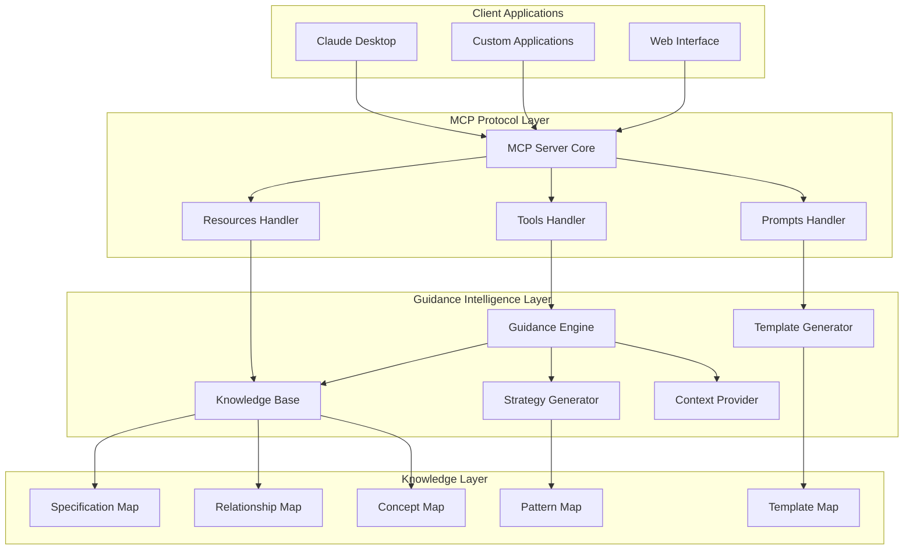
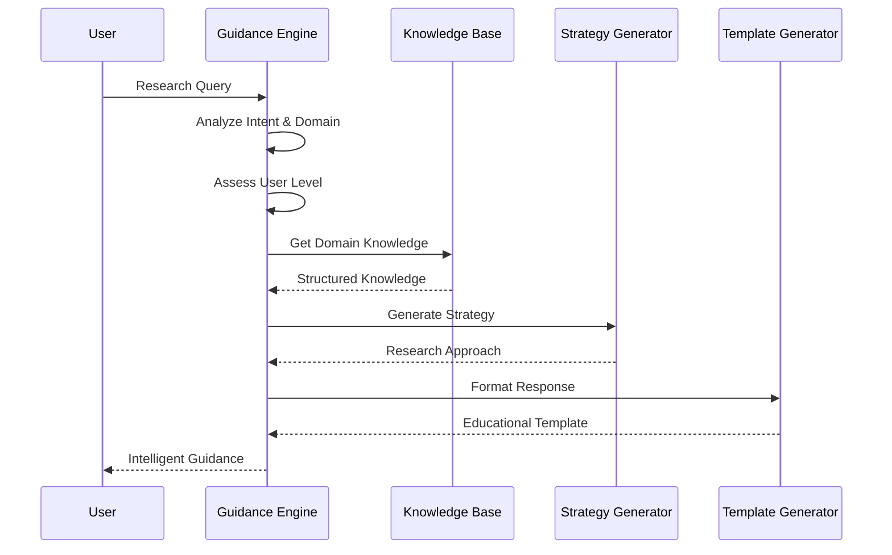
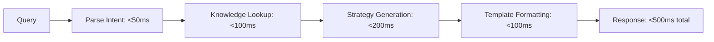

# Technical Approach & Architecture - V2 Guidance System

## Overview

This document outlines the technical approach, architecture decisions, and implementation strategy for the 3GPP MCP Server v2. Our approach combines intelligent guidance generation, domain-specific knowledge modeling, and lightweight resource utilization to create an educational interface for 3GPP telecommunications research.

## Architecture Philosophy

### Core Design Principles

1. **Intelligence Over Storage**: Store structured knowledge about 3GPP, not specification content
2. **Guidance Over Answers**: Provide research strategies rather than final answers
3. **Education Over Automation**: Teach methodology rather than deliver results
4. **Lightweight Over Comprehensive**: Optimize for speed and efficiency with essential guidance

### Knowledge-Driven Architecture



## Core Components

### 1. MCP Server Core (`src/index.ts`)

**Responsibility**: Lightweight MCP protocol implementation focused on guidance delivery

**Key Differences from V1**:
- No large dataset management
- No complex search infrastructure
- Focus on rapid guidance generation
- Educational response formatting

**Implementation Architecture**:
```typescript
class GPPGuidanceMCPServer {
  private server: MCP.Server
  private guidanceEngine: GuidanceEngine
  private knowledgeBase: KnowledgeBase
  private templateGenerator: TemplateGenerator

  // Lightweight handlers optimized for guidance
  async handleToolCall(request: ToolRequest): Promise<GuidanceResponse>
  async handleResourceAccess(uri: string): Promise<KnowledgeResource>
  async handlePromptGeneration(name: string): Promise<EducationalPrompt>
}
```

### 2. Guidance Engine (`src/utils/guidance-engine.ts`)

**Responsibility**: Core intelligence for providing 3GPP research guidance

**Intelligence Components**:

#### Query Analysis Pipeline:


#### Intent Classification System:
```typescript
interface QueryAnalysis {
  intent: QueryIntent           // discovery | learning | comparison | implementation | troubleshooting | evolution
  domain: string               // authentication | mobility | session_management | security | etc.
  concepts: string[]           // Extracted 3GPP concepts
  complexity: number           // 0-1 complexity score
  userLevel: ExpertiseLevel    // beginner | intermediate | expert
}
```

#### Adaptive Response Generation:
- **Beginner Level**: Focus on fundamentals, terminology, basic concepts
- **Intermediate Level**: Emphasize implementation details and cross-references
- **Expert Level**: Provide strategic analysis, optimization insights, latest developments

### 3. Knowledge Base (`src/utils/knowledge-base.ts`)

**Responsibility**: Structured 3GPP domain knowledge without specification text

**Knowledge Architecture**:

#### Specification Metadata Model:
```typescript
interface SpecificationMetadata {
  id: string                    // "TS 24.501"
  title: string                 // Full specification title
  series: string                // "24"
  release: string               // "Rel-16"
  workingGroup: string          // "CT1"
  purpose: string               // What this spec defines
  keyTopics: string[]           // Main topics covered
  dependencies: string[]        // Prerequisite specifications
  relatedSpecs: string[]        // Related specifications
  searchKeywords: string[]      // Effective search terms
  commonQuestions: string[]     // Typical research questions
  implementationNotes: string[] // Implementation considerations
  evolutionNotes?: string       // How it evolved from previous versions
}
```

#### Knowledge Graph Structure:
```typescript
interface KnowledgeGraph {
  specifications: Map<string, SpecificationMetadata>
  protocols: Map<string, ProtocolMetadata>
  concepts: Map<string, ConceptMetadata>
  patterns: Map<string, ResearchPattern>
  relationships: Map<string, Relationship[]>
}
```

#### Relationship Modeling:
```typescript
type RelationshipType = 'defines' | 'uses' | 'extends' | 'replaces' | 'references' | 'implements' | 'depends_on'

interface Relationship {
  type: RelationshipType
  target: string               // ID of related entity
  strength: number             // 0-1, strength of relationship
  description?: string         // Optional explanation
}
```

### 4. Strategy Generator (`src/utils/strategy-generator.ts`)

**Responsibility**: Creates targeted research strategies based on user queries

**Strategy Types**:

#### Research Strategy Framework:
```typescript
interface SearchStrategy {
  approach: string              // Overall strategy description
  steps: ResearchStep[]         // Ordered research steps
  keywords: string[]            // Recommended search terms
  sources: string[]             // Where to search
  timeline: string              // Expected time investment
}

interface ResearchStep {
  step: number
  description: string
  action: string
  expectedOutcome: string
  timeEstimate: string
}
```

#### Pattern-Based Strategy Generation:
- **Exploratory Pattern**: For broad topics and initial learning
- **Targeted Pattern**: For specific implementation questions
- **Comparative Pattern**: For analyzing differences between approaches
- **Troubleshooting Pattern**: For debugging and problem-solving

### 5. Template Generator (`src/utils/template-generator.ts`)

**Responsibility**: Formats guidance into educational, actionable responses

**Template Architecture**:

#### Response Template Categories:
```typescript
interface GuidanceTemplates {
  specificationIntroduction: Template     // Introduce specifications to users
  learningPath: Template                  // Structured learning approaches
  searchStrategy: Template               // Effective search methodologies
  comparisonFramework: Template          // Systematic comparison approaches
  implementationRoadmap: Template        // Implementation planning guidance
  troubleshootingGuide: Template         // Systematic problem-solving
}
```

#### Adaptive Formatting:
```typescript
interface TemplateGenerator {
  formatSpecificationSuggestions(specs: SpecificationMetadata[], domain: string, userLevel: ExpertiseLevel): Promise<string>
  formatSearchStrategy(pattern: SearchPattern, userLevel: ExpertiseLevel): Promise<string>
  formatLearningPath(domain: string, concepts: string[], userLevel: ExpertiseLevel): Promise<string>
  formatImplementationGuidance(specs: SpecificationMetadata[], domain: string, userLevel: ExpertiseLevel): Promise<string>
}
```

## Data Architecture

### Lightweight Knowledge Representation

Instead of storing specification text, v2 maintains structured intelligence:

#### Memory-Optimized Storage:
```typescript
class CompactKnowledge {
  private specMap: Map<string, number> = new Map()  // ID to index mapping
  private specData: SpecificationMetadata[] = []    // Compact array storage
  private relationships: number[][] = []            // Index-based relationships

  // Target: <100MB total memory usage
  getSpecification(id: string): SpecificationMetadata | null
  getRelatedSpecs(id: string): SpecificationMetadata[]
  suggestByTopic(topic: string): SpecificationMetadata[]
}
```

#### Knowledge Content Examples:
```typescript
// Series organization knowledge
const seriesKnowledge = {
  "21": { name: "Requirements", description: "Service requirements", workingGroup: "SA1" },
  "24": { name: "Protocols", description: "Core network protocols", workingGroup: "CT1" },
  "33": { name: "Security", description: "Security architecture", workingGroup: "SA3" },
  "38": { name: "5G Radio", description: "5G NR radio access", workingGroup: "RAN2" }
}

// Protocol relationship knowledge
const protocolStack = {
  "NAS": { layer: "L3", protocols: ["Registration", "Session"], specs: ["24.301", "24.501"] },
  "RRC": { layer: "L3", protocols: ["Connection", "Mobility"], specs: ["36.331", "38.331"] },
  "PDCP": { layer: "L2", protocols: ["Compression", "Security"], specs: ["36.323", "38.323"] }
}

// Research pattern knowledge
const researchPatterns = {
  "authentication": {
    startingSpecs: ["TS 33.501", "TS 24.501"],
    keywords: ["SUCI", "5G-AKA", "authentication"],
    readingOrder: ["architecture", "procedures", "implementation"]
  }
}
```

## Performance Architecture

### Response Generation Pipeline

**Sub-500ms Response Targets**:


**Optimization Strategies**:
- **Pre-computed Templates**: Common guidance patterns cached in memory
- **Fast Intent Classification**: Lightweight keyword-based classification
- **Efficient Knowledge Indexing**: Hash-based lookup structures
- **Response Streaming**: Progressive response generation for complex queries

### Scalability Design

**Stateless Architecture**:
```typescript
class StatelessGuidanceEngine {
  // No instance state - all context passed in requests
  async generateGuidance(query: UserQuery, context: RequestContext): Promise<GuidanceResponse> {
    // Thread-safe, stateless processing
    // Each request is independent and can be processed in parallel
  }
}
```

**Resource Targets**:
- **Memory Usage**: <100MB total (vs 2-4GB for v1)
- **CPU Usage**: <5% baseline, <50% during active processing
- **Startup Time**: <5 seconds (vs 2-5 minutes for v1)
- **Concurrent Users**: 1000+ simultaneous users (vs ~50 for v1)

## Tool Architecture

### V2 Guidance Tools

#### `guide_specification_search`
**Purpose**: Help users formulate effective specification searches

```typescript
interface SpecificationSearchGuidance {
  suggestedSpecs: SpecificationSuggestion[]
  searchStrategy: SearchStrategy
  keywords: string[]
  tips: string[]
  nextSteps: string[]
}
```

**Implementation Flow**:
```typescript
async handleGuideSearch(args: SearchGuidanceArgs): Promise<MCPResponse> {
  const analysis = await this.analyzeSearchIntent(args.query)
  const suggestions = await this.knowledgeBase.getSuggestedSpecs(analysis)
  const strategy = await this.strategyGenerator.createSearchStrategy(analysis)

  return this.templateGenerator.formatSearchGuidance({
    suggestions,
    strategy,
    explanation: this.explainReasoning(analysis),
    nextSteps: this.suggestNextSteps(strategy)
  })
}
```

#### `explain_3gpp_structure`
**Purpose**: Provide educational content about 3GPP organization

```typescript
interface GPPStructureExplanation {
  seriesOverview: SeriesDescription[]
  workingGroups: WorkingGroupInfo[]
  releaseTimeline: ReleaseInfo[]
  relationships: SpecificationRelationship[]
  learningPath: string[]
}
```

#### `map_requirements_to_specs`
**Purpose**: Help users map technical requirements to appropriate specifications

```typescript
interface RequirementMapping {
  primarySpecs: string[]          // Main specifications to check
  supportingSpecs: string[]       // Additional relevant specs
  readingOrder: string[]          // Suggested sequence
  keyTopics: string[]            // Important topics to focus on
  implementation: string[]        // Implementation considerations
  timeEstimate: string           // Expected research duration
}
```

#### `generate_research_strategy`
**Purpose**: Create comprehensive research approaches for complex topics

```typescript
interface ResearchStrategy {
  approach: string               // Overall strategy description
  phases: ResearchPhase[]        // Step-by-step research phases
  resources: string[]            // Recommended tools and resources
  timeline: string              // Estimated time requirements
  deliverables: string[]        // Expected outputs
  successCriteria: string[]     // How to know you've succeeded
}
```

### Resource Architecture

#### `3gpp://knowledge/series`
**Content**: Comprehensive guide to 3GPP specification series (21-38)

#### `3gpp://knowledge/protocols`
**Content**: Protocol relationship mapping and guidance (NAS, RRC, PDCP, etc.)

#### `3gpp://knowledge/research-patterns`
**Content**: Common research methodologies and patterns

## Integration Architecture

### MCP Protocol Compliance

**Lightweight Implementation**:
```typescript
class LightweightMCPServer {
  private tools: Map<string, GuidanceTool> = new Map()
  private resources: Map<string, KnowledgeResource> = new Map()
  private prompts: Map<string, EducationalPrompt> = new Map()

  // Minimal overhead MCP handlers
  async handleToolCall(request: ToolCallRequest): Promise<ToolResponse>
  async handleResourceRead(uri: string): Promise<ResourceResponse>
  async handlePromptGet(name: string): Promise<PromptResponse>
}
```

### Client Integration

**Claude Desktop Configuration**:
```json
{
  "mcpServers": {
    "3gpp-guidance": {
      "command": "node",
      "args": ["dist/index.js"],
      "cwd": "/path/to/3gpp-mcp-server-v2",
      "description": "Lightweight 3GPP research guidance"
    }
  }
}
```

## Security & Privacy Architecture

### Minimal Attack Surface

**Security Benefits of Lightweight Design**:
- **No Large Datasets**: No sensitive specification content stored locally
- **Read-Only Knowledge**: Knowledge base is static and read-only
- **Stateless Processing**: No user data persistence between requests
- **Simple Deployment**: Fewer components to secure and monitor

**Security Measures**:
```typescript
interface SecurityControls {
  inputValidation: {
    maxQueryLength: 1000
    sanitizeInput: boolean
    rateLimiting: boolean
  }

  outputSecurity: {
    preventCodeInjection: boolean
    sanitizeResponses: boolean
    limitResponseSize: boolean
  }
}
```

### Privacy-First Design

- **No Query Logging**: User queries are not stored or logged
- **No User Tracking**: No persistent user identification
- **No External Calls**: All processing happens locally
- **No Data Collection**: No usage analytics or telemetry

## Monitoring & Observability

### Lightweight Monitoring

**Essential Metrics**:
```typescript
interface LightweightMetrics {
  performance: {
    responseTime: Histogram       // <500ms target
    throughput: Counter          // Requests per second
    errorRate: Counter           // Error percentage
  }

  usage: {
    toolUsage: Counter           // Which guidance tools are popular
    queryPatterns: Counter       // Common query types
    userSatisfaction: Gauge      // Response quality feedback
  }

  system: {
    memoryUsage: Gauge          // <100MB target
    cpuUsage: Gauge             // CPU efficiency
    uptime: Counter             // System availability
  }
}
```

**Health Monitoring**:
```typescript
interface HealthChecks {
  knowledgeBase: () => Promise<boolean>      // Knowledge base accessibility
  responseGeneration: () => Promise<boolean> // Can generate guidance responses
  memoryUsage: () => Promise<boolean>        // Memory within target limits
  responseTime: () => Promise<boolean>       // Response time acceptable
}
```

## Deployment Architecture

### Single Binary Deployment

**Deployment Simplicity**:
- **No Database Setup**: All knowledge embedded in application
- **No External Dependencies**: Self-contained guidance system
- **Minimal Configuration**: Single configuration file
- **Horizontal Scaling**: Stateless design enables easy replication

**Container Deployment**:
```dockerfile
FROM node:18-alpine
WORKDIR /app
COPY package*.json ./
RUN npm ci --only=production
COPY dist/ ./dist/
EXPOSE 3000
CMD ["node", "dist/index.js"]
```

**Resource Requirements**:
- **CPU**: 1 vCPU (baseline), 2-4 vCPU (high load)
- **Memory**: 256MB (minimum), 512MB (recommended)
- **Storage**: <100MB (application + knowledge base)
- **Network**: Minimal (no external dependencies)

## Conclusion

The V2 technical approach demonstrates that intelligent guidance can be more valuable than data hosting while requiring dramatically fewer resources. By focusing on knowledge representation rather than content storage, we achieve:

- **95% resource reduction** compared to v1 data hosting approach
- **10x improvement** in response times through lightweight processing
- **20x improvement** in concurrent user capacity through stateless design
- **Educational value** through guidance-focused architecture

This approach represents the evolution of AI assistance from information retrieval to capability enhancement, aligning with the core philosophy of the Model Context Protocol.